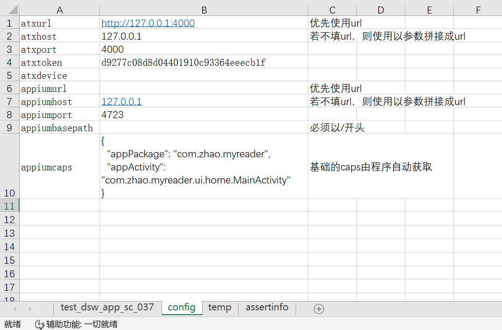
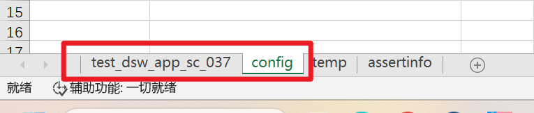
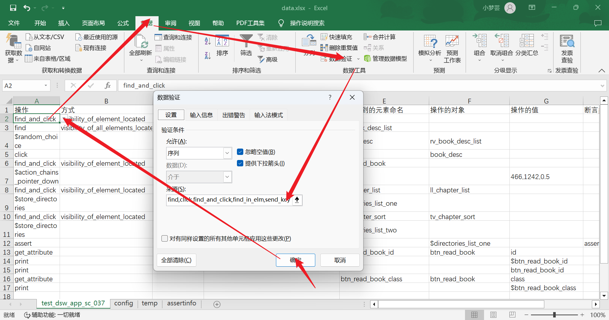
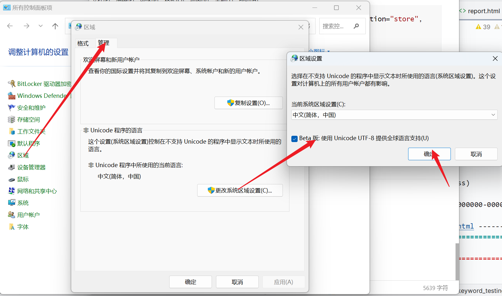

# IntegraDataAuto - 数据驱动的移动自动化测试框架

## 概述

IntegraDataAuto是一个基于ATXServer2设计的移动设备自动化测试框架，具有以下特点:

- **数据驱动**:使用Excel表格配置测试设备信息和编写测试用例，实现数据驱动的自动化测试；
- **远程管理**:支持通过ATX Server远程连接并管理多台移动设备，无需在本机直接连接设备；
- **设备选择**:每次测试会自动随机选择或根据Excel配置条件选择指定设备,无需每次都重写配置信息；
- **跨平台**:目前支持Android平台的自动化测试，未来计划继续扩展为支持iOS和Web平台。

​		IntegraDataAuto通过Excel数据配置和ATX Server的远程设备管理，大大简化了移动应用的自动化测试。测试人员无需手动连接设备，只需要在Excel里配置设备信息和编写测试用例，即可轻松实现在多设备上的数据驱动的自动化测试。

​		该框架易于维护和扩展，目前已支持Android测试场景，未来将继续扩展对iOS和Web应用的自动化测试支持。


## 快速上手

### 环境搭建

> 其中 atxserver2-android-provider 推荐使用 python3.6 版本
>
> 在配置 atxserver2 时需要使用到 node.js 推荐使用版本为8，npm 为6
>
> 安装好之后可以将 python 、node、npm 换回较高版本
>
> （推荐使用 windows 的 node 环境管理工具 nvm）

1. node.js （版本为8 npm为6）

​		安装网址：http://nodejs.cn/download/

2. rethinkdb

​		安装网址：https://rethinkdb.com/docs/install/

​		项目中的安装包目录有

3. atxserver2：

​		安装网址： https://github.com/openatx/atxserver2

4. atxserver2-android-provider：（python3.6）

​		安装网址：https://github.com/openatx/atxserver2-android-provider

5. python：

   需要的软件包及版本在 requirements.txt 列出

   ```powershell
   pip install -r requirements.txt
   ```

### 环境启动

在项目的 server 目录下写了开启环境的脚本，可以在里面修改路径

> 环境启动.py 有点bug，每次开机如果不先在命令行手动启动，就获取不到设备，但是如果先在命令行启动又终止，再使用 py 脚本启动，是可以成功启动的

`startenv.bat` 启动环境没问题（就是要打开四个黑框框，有点强迫症）

`环境关闭.py` 关闭环境没问题（可能会遇上编码问题，但是功能没问题）

### 开始测试

在 testcase 中运行命令

> xxx 为测试用例名字

``` powershell
cd ./testcase
pytest xxx.py --html=report.html -v
```

### demo

1. 安装 APP（安装包下 appdebug.apk ）

2. 在 `./excel/data/data.xlsx` 中的 `conf` 工作表环境配置

   （详见参数说明）

   

3. 编写测试用例

   在 `./excel/data/data.xlsx` 中，工作表为  `test*` 或者 `*test` 

   > 每一个以 test 开头或以 test 结尾的工作表都会被视作一个单独的测试用例

| 操作                        | 方式                               | 选择器           | 定位元素的值                         | 给获取到的元素命名   | 操作的对象            | 操作的值     | 断言类型            | 断言的值              |
| --------------------------- | ---------------------------------- | ---------------- | ------------------------------------ | -------------------- | --------------------- | ------------ | ------------------- | --------------------- |
| find_and_click              | visibility_of_element_located      | accessibility id | 书城                                 | 书城                 | 书城                  |              |                     |                       |
| find                        | visibility_of_all_elements_located | id               | com.zhao.myreader:id/tv_book_desc    | rv_book_desc_list    |                       |              |                     |                       |
| $random_choice              |                                    |                  |                                      | book_desc            | rv_book_desc_list     |              |                     |                       |
| click                       |                                    |                  |                                      |                      | book_desc             |              |                     |                       |
| find_and_click              | visibility_of_element_located      | id               | com.zhao.myreader:id/btn_read_book   | btn_read_book        |                       |              |                     |                       |
| $action_chains_pointer_down |                                    |                  |                                      |                      |                       | 466,1242,0.5 |                     |                       |
| find_and_click              | visibility_of_element_located      | id               | com.zhao.myreader:id/ll_chapter_list | ll_chapter_list      | ll_chapter_list       |              |                     |                       |
| $store_directories          |                                    |                  |                                      | directories_list_one |                       |              |                     |                       |
| find_and_click              | visibility_of_element_located      | id               | com.zhao.myreader:id/tv_chapter_sort | tv_chapter_sort      | tv_chapter_sort       |              |                     |                       |
| $store_directories          |                                    |                  |                                      | directories_list_two |                       |              |                     |                       |
| assert                      |                                    |                  |                                      |                      | $directories_list_one |              | assert_list_reverse | $directories_list_two |

4. 开始测试

   在 pycharm 中运行 test_main.py 文件

   如果需要测试报告，则使用命令行运行

   ```powershell
   cd ./testcase
   pytest test_main.py --html=report.html -v
   pytest test_main.py --html=report.html -v --excel_path=../excel/data/data.xlsx
   ```
   
> 可选参数：excel_path


## 参数说明

1. `excel_path` 数据表的路径 可选 

   默认为 `./excel/data/data.xlsx` 

   来源：命令行

   ```powershell
   cd ./testcase>
   pytest test_main.py -h
   # 在 Custom options 部分或搜索 excel_path 可以看到
   ```

   代码：

   ```python
   # conftest.py
   def pytest_addoption(parser):
       parser.addoption("--excel_path", action="store", default="../excel/data/data.xlsx",
                        help="可选参数，默认为../excel/data/data.xlsx")
       
   # test_main.py
   def test_main(pytestconfig, android_driver):
       excel_path = pytestconfig.getoption("excel_path")
   ```

2. `sheet_name` 工作表名称 自动获取

   来源：表
   
   
   
   代码：
   
   ```python
   def test_main(pytestconfig, android_driver):
       excel_path = pytestconfig.getoption("excel_path")
       sheet_names = get_all_test_sheet_name(excel_path)
   # readExcel.py
   def get_all_test_sheet_name(excel_path):
   ```
   
3. atx 相关配置

   | 参数名    | 示例值                                          | 备注                                                         |
   | --------- | ----------------------------------------------- | ------------------------------------------------------------ |
   | atxurl    | [http://127.0.0.1:4000](http://127.0.0.1:4000/) | 优先使用url                                                  |
   | atxhost   | 127.0.0.1                                       | 若不填url，则使用以参数拼接成url                             |
   | atxport   | 4000                                            | atx的端口，通常为4000                                        |
   | atxtoken  | d9277c08d8d04401910c93364eeecb1f                | 在http://localhost:4000/user获取，每次重新启动都有可能更新   |
   | atxdevice | FJH5T18C31075437                                | 填写则指定设备，填http://localhost:4000/devices 的设备编号，如不填写，则随机从已有设备列表中获取 |

   

4. appium 相关配置

   | 参数名         | 示例值                                                       | 备注                                           |
   | -------------- | ------------------------------------------------------------ | ---------------------------------------------- |
   | appiumurl      | [http://127.0.0.1:4723](http://127.0.0.1:4723/)              | 优先使用url                                    |
   | appiumhost     | [127.0.0.1](http://127.0.0.1:4723/)                          | --address <br />若不填url，则使用参数拼接成url |
   | appiumport     | 4723                                                         | --port                                         |
   | appiumbasepath | /wd/hub                                                      | --base-path <br />必须以/开头                  |
   | appiumcaps     | {      "appPackage":  "com.zhao.myreader",      "appActivity":  "com.zhao.myreader.ui.home.MainActivity"     } | 基础的caps由程序自动获取                       |

   > atx 和 appium 相关配置由 `readExcel.py` 读取，并存放在 `class Config` 中
   >
   > 在 `conftest.py` 中，通过实例化 Config 来为启动各项服务提供参数，如：启动 appium 服务、通过 atx 的 api 获取设备信息、占用设备、释放设备等

5. 用例参数

   > Excel 是承载数据的方式，直观、方便，因为Excel表格可以支持下拉选项，这是 JSON 、xml 、mysql等做不到的。

   以下均为代码内置的，复制后可以在 Excel 表格中设置下拉选项（如图）。

   

   操作：

   find,click,find_and_click,find_in_elm,send_keys,get_attribute,assert,page_source,print,$自定义函数

   方式：

   find_element,find_elements,visibility_of_element_located,presence_of_element_located,element_to_be_clickable,visibility_of_all_elements_located,presence_of_all_elements_located

   选择器：

   id,xpath,name,accessibility id,tag name,class name,css selector,link text,partial link text

   操作的对象：

   默认为 driver，可以设置为已定义的驱动器，比如 `driver.find_element()` 函数返回的结果

   操作的值：

   该值会作为参数传递给函数，如：`driver.send_keys(操作的值) `

   断言类型：

   assert_in,assert_in_one_local,assert_equal,assert_not_equal,assert_true,assert_false,assert_is,assert_is_not,assert_is_none,assert_is_not_none,assert_not_in,assert_is_instance,assert_not_is_instance,assert_list_reverse

   | 操作           | 方式 | 选择器 | 定位元素的值 | 给获取到的元素命名 | 操作的对象 | 操作的值 | 断言类型 | 断言的值 |
   | -------------- | ---- | ------ | ------------ | ------------------ | ---------- | -------- | -------- | -------- |
   | find           | √    | √      | √            | √                  |            |          |          |          |
   | click          |      |        |              |                    | √          |          |          |          |
   | find_and_click | √    | √      | √            | √                  |            |          |          |          |
   | find_in_elm    | √    | √      | √            | √                  | √          |          |          |          |
   | send_keys      |      |        |              |                    | √          | √        |          |          |
   | get_attribute  |      |        |              | √                  | √          | √        |          |          |
   | assert         |      |        |              |                    | √          |          | √        | ○        |
   | page_source    |      |        |              | ○                  | √          |          |          |          |
   | print          |      |        |              |                    |            | √        |          |          |
   | $自定义函数    | √    |        |              | ○                  | ○          | ○        |          |          |

> tips：
>
> 1. `find_and_click` 只支持定位**单个元素**，也就是非 elements；
> 2. `find_and_click` 的 `操作的对象` 默认为 find 操作获取的元素，即`给获取到的元素命名`；
> 3. `find_in_elm` 的 `操作的对象` 必须是前面定义过的，否则会报错；
> 4. `断言类型` 在 keys.TestAssertObject 中定义，不需要加 `$`，如：assert_equal；
> 5. `assert` 的参数值为 1-2 个，第一个是 `操作的对象`（必选） ，第二个是 `断言的值`（可选），两者都可以是变量，如：$val1，如果不加 $ ，则视为一个普通的字符串；
> 6. `$`开头的都属于**变量**，都在 TestContext 中通过**反射机制**获取；
> 7. 自定义函数在 keys.TestKeyWords 中定义，可以设置为无参或有参，如果有参数，传入自定义函数中的参数是表格中的内容，需要在自定义函数中**自己处理**；
> 8. 操作的对象为可选的时候，默认为 driver；

## 日志记录

每一步执行的操作都被记录在日志中

日志默认的名称为当前执行的用例的 `工作表名称.log` 

存储路径为：`./testcase/logs/工作表名称.log`

配置可以在 `Actuator.py` 中的 `mylogging(sheet_name)` 函数里修改

在 `actuator(sheet_name, excel_path)` 中实例化，作为参数传递给其他需要记录日志的函数

> 实例化方法：`logger = next(mylogging(sheet_name))` 

## 测试报告

直接在 pycharm 中运行 `test_main.py` 是不会有测试报告的

如果想要测试报告，可以在终端中运行命令：

```powershell
cd ./testcase
pytest test_main.py --html=report.html -v
# 可选参数 --excel_path
pytest test_main.py --html=report.html -v --excel_path=../excel/data/data.xlsx
```

报告会保存在 testcase 目录下

## 函数参数如何修改

框架使用 dict 模拟swich-case 

建立了一个 关键字 -- 函数名 -- 函数参数 映射的字典

在调用的时候会自动匹配字典，调整函数需要的参数

该字典形如：

```python
action_map = {
    'find': (
        find, ['driver', 'wait', 'action_type', 'selector', 'selector_value', 'element_name', 'row_num', 'logger']),
    'click': (click, ['driver_name', 'action', 'row_num', 'logger']),
    'find_and_click': (
        find_and_click,
        ['driver_name', 'wait', 'action_type', 'selector', 'selector_value', 'element_name', 'row_num', 'logger'])
}

```

> tips
>
> 1. 以 `$` 开头的自定义函数需要单独处理，因为无法在字典中匹配动态的名称
>
>    处理方法：
>
>    ```python
>            if action.startswith("$"):
>                startswith_(driver_name, action, action_value, element_name, row_num, logger)
>                continue
>    ```

## 常见问题

###  报告是乱码

修改 windows 系统的编码


